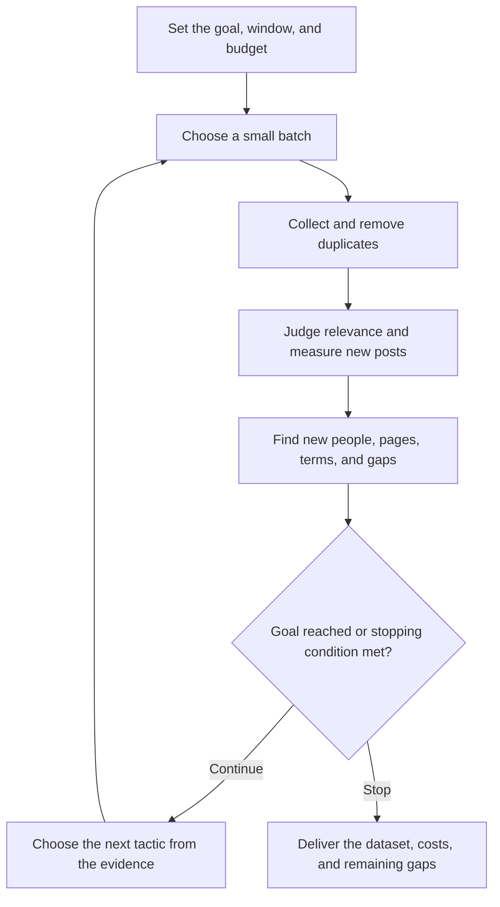

# How the fan-out loop works

Each batch of posts gives you clues about where to look next.

Someone writes three useful posts about your event. Your agent checks their other posts and the posts they reacted to. That uncovers a partner company discussing a session. It collects the company's posts and searches the session language. Some of those results introduce other active people worth following.

This is **fan-out**: following the conversation outward from the people, pages, and terms you discover. The agent repeats the process, using the results to decide which branches deserve another round.

## Give the agent a goal

For example: “Build a broad sample of this event's conversation, including customers, partners, and people outside the host company. Cover the event week and recaps. Spend up to the limit I approve, and stop when further routes add little.”

You can add a target such as 500 relevant posts or a particular audience you need represented. A post target helps define when you have enough for your purpose. It does not establish how much of LinkedIn you found.

Your agent proposes the collection plan in plain English. You approve the spending limit and whether it should continue after the pilot. A pilot-only approval ends at the pilot. A full collection approval lets it choose subsequent batches within that scope.

## What a sequence might look like

**Illustrative example. These are invented round results to show the decisions, not results or cost promises from our studies.**

| Round | What the agent tries | New relevant posts | What changes next |
|---|---|---:|---|
| 1 | A narrow event search | 38 | Several people post repeatedly; two partner company pages appear. Save those leads. |
| 2 | A second search sort and a session-name query | 24 | Search adds posts but still mostly reaches host voices. Prioritize the partner pages. |
| 3 | Posts from the two partner pages | 31 | Find a product phrase and three active non-host posters. Add both kinds of lead to the queue. |
| 4 | Those people's own posts and reactions | 47 | Find another company page and a different group of authors. Follow those discoveries in round 5. |
| 5 | The newly discovered page and authors | 29 | Two authors discuss the same workshop. Add its exact language as a search lead. |
| 6 | The workshop phrase and the product phrase | 18 | New posts include quieter customer perspectives. Most remaining leads now overlap with earlier rounds. |
| 7 onward | Test the remaining promising leads and coverage gaps | Measured each round | Continue if they add useful posts. Stop only when the agreed conditions are met. |

The next event may take a different path. A company-page pull could be weak. A new phrase could open a productive branch. The agent should change its plan when the evidence changes.

## What you should see after each round

> “Round 4 added 47 relevant posts. We now have 140. This batch cost $X, with $Y still available after reservations. The strongest new lead is a company page found in these posts. I'll test that page and the new active authors next because we still have little coverage of customer sessions.”

The update should connect **the result to the next action**. The agent also saves its leads and decisions in your folder. It handles the bookkeeping; you can read the reports whenever you want.

It counts posts that are new to the whole collection. A batch returning 100 posts you already have adds zero. An older post that the agent finally labels relevant is reported separately from newly discovered posts.

## When it should continue, change direction, or stop

- **Continue a productive branch:** new relevant posts keep introducing promising people, pages, or phrases.
- **Change direction:** results are mostly duplicates, off-topic, or confined to a part of the conversation already well represented. Test a different source or fill a gap.
- **Finish:** your agreed goal is satisfied, the approved budget cannot fund another useful batch, or multiple distinct routes show diminishing returns and no promising affordable leads remain.
- **Pause with work saved:** you ask to pause, the session ends, or a collection problem needs resolving. That is unfinished collection. Reopen the folder and resume.

Two weak searches do not mean the whole conversation is exhausted. If company pages or active posters remain unexplored, those are still possible next moves. Likewise, one useful branch should not consume the whole budget while a priority audience or date range remains missing.

The agent records why it stopped and what it would try with more time or budget. It cannot guarantee every event post. An optional independent reference sample can measure recovery against that sample after discovery is frozen.

[Start the kit](README.md) · [Setup and next steps](QUICK-START.md)
